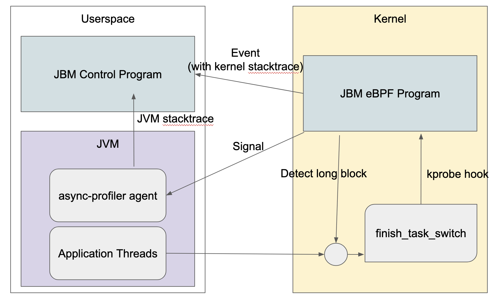

# JBM

> JBM = Java Blocking Monitor

JBM is an agent that monitors JVM processes from the kernel using eBPF. It detects when an application thread is blocking for an extended period of time and generates a backtrace from the kernel to userspace. It then reports this information, providing valuable insights into blocking issues within your JVM applications.


# Building

1. Install rustup: https://rustup.rs/
2. Install Rust and bpf-linker
```sh
rustup install stable
rustup toolchain install nightly --component rust-src
cargo install bpf-linker
```
3. Build JBM
```sh
git clone https://github.com/kawamuray/jbm.git
cd jbm

# Build async-profiler
git submodule update --init
cd async-profiler
git submodule update --init
make -j8

cd ..

# Build JBM
cargo xtask build-ebpf --release
cargo build --release
# Now binrary is ready at:
./target/release/jbm
```

# Usage

```sh
# Example usage for detecting "block" behavior defined as a thread stopped over a second but less than a minute
jbm -p TARGET_JVM_PID --min-block-time 1000000 --max-block-time 60000000
```

# How it works



After startup JBM installs an eBPF program that adds kprobe for `finish_task_switch` function. By hooking `finish_stask_switch` function, we can detect when a task become off-cpu and on-cpu, hence by computing duration since last off, we can detect if a task has blocked for a long time.
The target JVM gets the custom [async-profiler](https://github.com/async-profiler/async-profiler) attached.
The eBPF program then sends an event when it detects long blocking, and user space control program zips the kernel space backtrace obtained by an event from eBPF with the event generated by the custom async-profiler running on the target JVM, which generates an event in response to receiving singnal from the eBPF program.

## License

JBM is licensed under the [MIT License](https://opensource.org/licenses/MIT). You are free to use, modify, and distribute this software. See the `LICENSE` file for more information.
